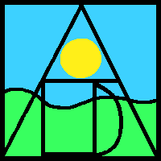
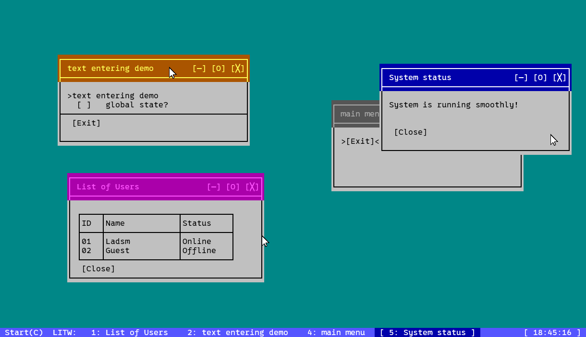
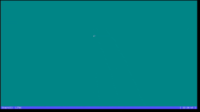

<div align="center">
  
  <h1>Lad In The Window (LITW)</h1>
  <p><strong>A TUI that looks like a GUI.</strong></p>
 
##  Demo

  
  
</div>

## Core Ideas

*   **Window:** An object that holds widgets.
*   **Widgets:** An object inside a window. The base of interaction in LITW.

LITW is designed to be completely dependency-free. You only need a standard C++ compiler and CMake to get started.

#### Prerequisites
*   **Windows:** MSVC (Visual Studio) or MinGW
*   **Linux/macOS:** GCC or Clang
*   **Build System:** CMake (3.10 or higher recommended)

#### Build Instructions
```sh
git clone https://github.com/ladsm/Lad-in-the-Window.git
cd Lad-in-the-Window
mkdir build && cd build
cmake ..
cmake --build .
# Linux/macOS:
./LITW 
# Windows:
.\Debug\LITW.exe
```

> *Note*  
>  For the best experience, use a modern terminal like [Windows Terminal](https://github.com/microsoft/terminal), [Alacritty](https://github.com/alacritty/alacritty), or [kitty](https://github.com/kovidgoyal/kitty) that supports 24-bit color and SGR mouse tracking.

> TTY Only  
> For TTY only, use (KMSCON)[https://github.com/kmscon/kmscon] for 24 bit color.

<div align="center">

## Controls

| Category  | Key(s) | 	Action |
| ------------- | ------------- | ------------- |
| Windows  | 1 - 9  | Focus window by index |
|    | Escape | Cycle window focus |
| Window Operations  | Q / X | Minimize / Close |
| | E / R |	Move / Resize mode|
| Navigation | WASD / Arrows | Move cursor/selection |
| System  | C | Open Start Menu |
| Mouse | Left Click | Focus Window |
| | Left Drag | Move Window |


</div>
